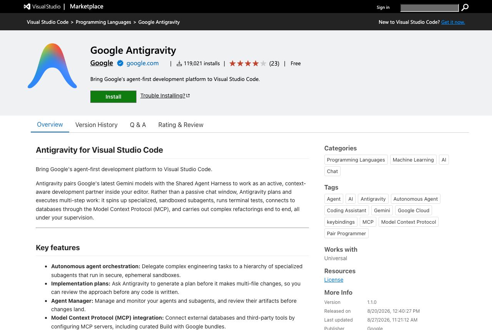

# Your coding agent

This course treats coding agents as instruments you are here to master, so you need one running before
the first precept. Our shared starting point is **Google Antigravity**, because its free tier costs
nothing, needs no credit card, and gives you a real agent rather than a chat window.

If you already pay for another agent, keep using it. The course never asks which tool you used, only
what it did and what you verified.

---

## What you need

- A **personal Google account** (an `@gmail.com` address). University Workspace accounts are not
  supported by Antigravity's free tier, so your `@princeton.edu` address will not work here. Making a
  free personal account for the course is fine and takes two minutes.
- VS Code, already installed in the setup guide.

Free tier, as of the start of the semester: unlimited completions and basic weekly rate limits, with
access to Gemini and Claude models. Limits are per person, so in class you will work in pairs and one
signed-in account per pair is enough.

## Install it

1. Open VS Code **in a normal window**, not the container window. If the bottom left corner shows a
   green **Dev Container** label, open a second window with **File > New Window**.
2. Open the Extensions sidebar (`Cmd+Shift+X` on a Mac, `Ctrl+Shift+X` on Windows).
3. Search for **Google Antigravity**, published by Google, and click **Install**.
4. Click the Antigravity icon in the left activity bar, then **Sign In**. Your browser opens; sign in
   with your personal Google account and come back to VS Code.


[SCREENSHOT: agent-02-signed-in.png, the Antigravity panel after a successful sign-in]

## How we use it in class

Two windows, one folder. It sounds odd for about a minute and then feels natural.

- The **container window** is where notebooks run. It has the course environment, the data, and the
  kernel.
- The **normal window**, opened on the same course folder, is where your agent lives.

Both windows look at the same files on your disk, so code the agent writes is immediately visible to
the notebook side. In practice you will ask the agent for a piece of code, read it, and paste it into
your notebook cell, which is exactly the workflow we are practising: specify, delegate, verify.

To open the second window on the same folder: **File > New Window**, then **File > Open Folder** and
pick the same `CEE420-Urban-AI` folder GitHub Desktop cloned for you.

## If you are on the Codespaces lane

Agent extensions that sign in through a browser callback tend not to work inside a browser-based
Codespace. If Antigravity will not sign in there, do not fight it. Open
<https://gemini.google.com> or any chat assistant you have in another tab and use the same written
specification from the handout. You lose the in-editor convenience and lose nothing that the course
grades.

## The specification, not the wish

The one habit worth forming now. Before you ask an agent for anything, write three lines:

```text
PLACE:  which data, which file, which coordinate system
TASK:   what to compute, in what units
OUTPUT: what you want back, a number, a map, a table

Constraints: work only in this notebook, geopandas only, do not modify
earlier cells, no new packages, no internet access.
```

Then read what comes back before you run it, and check it afterwards. In this course an unverified
answer is not an answer, whether a human or a machine produced it.

## When it does not work

- **Sign-in fails with a Workspace account**: use a personal `@gmail.com` account, this is a
  documented limitation.
- **The panel never loads in the container window**: expected, that is why we run it in a normal
  window. Use the two-window setup above.
- **You hit a rate limit mid-session**: pair up, one working account per pair is all we need.
- **Nothing works on your machine at all**: you are still fine. Bring the written specification to
  class and use any chat assistant; that path is fully supported and A01 explicitly accepts an honest
  "I tried, it failed, here is how I did it by hand".
