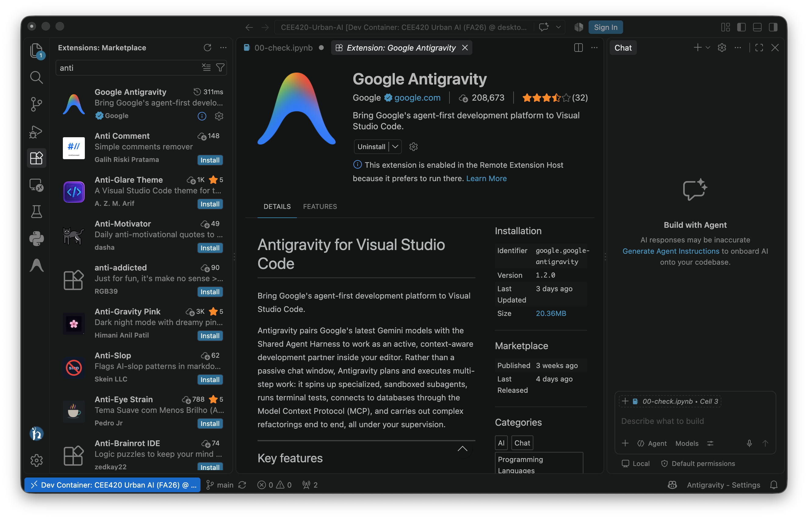
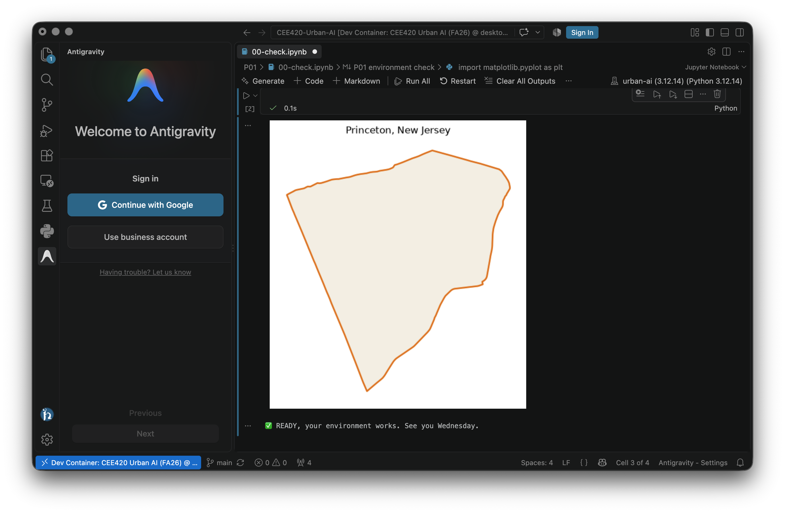
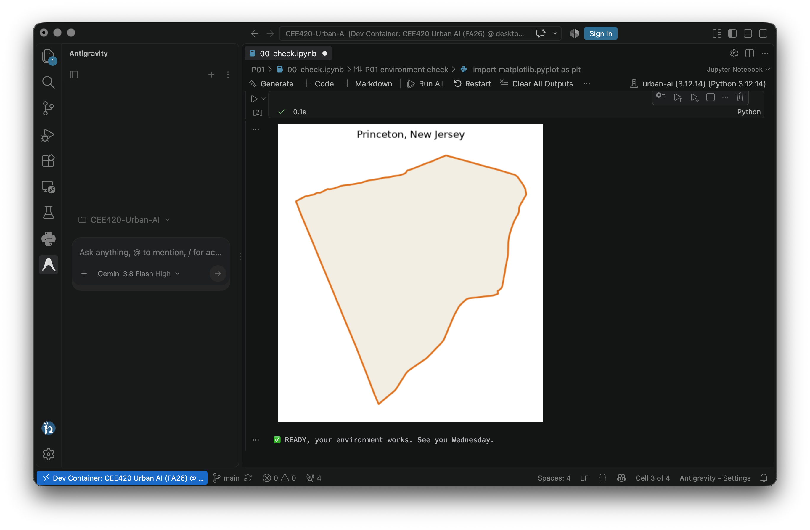

# =============================================================================
# File      : agent-antigravity.org -- Coding agent setup and use
# Author    : Jürgen Hackl <hackl@princeton.edu>
# Time-stamp: <2026-09-07>
# Copyright (c) 2026 Jürgen Hackl <hackl@princeton.edu>
# =============================================================================
#+OPTIONS: toc:nil
#+OPTIONS: num:nil
#+OPTIONS: tags:nil
#+TITLE: Your Coding Agent
#+SUBTITLE: CEE420 Urban AI
#+AUTHOR: Jürgen Hackl
#+EMAIL: <hackl@princeton.edu>

# -----------------------------------------------------------------------------
#+LATEX_COMPILER: lualatex
#+LATEX_CLASS: princeton
#+LATEX_CLASS_OPTIONS: [11pt]
#+LATEX_HEADER: \version{v0.2}
# =============================================================================

#+latex: \maketitle

This course treats coding agents as instruments you are here to master, so you need one running before the first precept. Our shared starting point is *Google Antigravity*, because its free tier costs nothing, needs no credit card, and gives you a real agent rather than a chat window.

If you already pay for another agent, keep using it. The course never asks which tool you used, only what it did and what you verified.

--------------

* You do not have to install it
Antigravity is part of the course environment. When you open the repository in its container, VS Code installs the extension for you and it runs *inside* the container, next to your notebooks and your data. There is no separate download, no second window, and nothing to configure.

You will see it as a small icon in the left activity bar once the container has finished starting.

#+ATTR_LATEX: :width \linewidth :float nil

* What you do need: a personal Google account
One thing is yours to arrange. Antigravity's free tier works with a *personal Google account*, an =@gmail.com= address. University Workspace accounts are not supported on this tier, so your =@princeton.edu= address will not sign in. Making a free personal account for the course is entirely fine and takes two minutes.

Free tier, as of the start of the semester: unlimited completions and basic weekly rate limits, with access to current Gemini and Claude models. The limits are per person, so in class you will work in pairs and one signed-in account per pair is plenty.

* Signing in
1. Click the Antigravity icon in the left activity bar.
2. Click *Sign In*. Your browser opens.
3. Sign in with your personal Google account, then come back to VS Code.

Do this before Wednesday, not during class. It is the one step that needs a browser, an account, and your patience all at once.

#+ATTR_LATEX: :width \linewidth :float nil

* Working with it
The agent sees the same files and the same Python as you do, so it can read =P01/data=, write a cell, and run it. That convenience is exactly why the course spends a whole session on verification: an agent that can run things can also be confidently wrong at speed.

Two habits, and they are the whole method.

*Specify before you ask.* Write three lines first, so that you know what a correct answer would look like before you see one:

#+begin_example
PLACE:  which data, which file, which coordinate system
TASK:   what to compute, in what units
OUTPUT: what you want back, a number, a map, a table

Constraints: work only in this notebook, geopandas only, do not modify
earlier cells, do not install new packages.
#+end_example

The constraint about packages matters. The environment is pinned so that twelve laptops behave identically, and an agent that installs something to solve a problem has quietly made your setup different from everyone else's.

*Verify after it answers.* Read the code before you trust the number. Check the coordinate reference system, check the result against something you computed yourself, and look at the map rather than only the figure it prints. In this course an unverified answer is not an answer, whoever produced it.

#+ATTR_LATEX: :width \linewidth :float nil

* When it does not work
- *Sign-in fails with your Princeton address*: expected, use a personal =@gmail.com= account.
- *The icon is missing*: the container is probably still starting, or you are in a plain VS Code window. Check the bottom left corner for the blue *Dev Container: CEE420 Urban AI (FA26)* label.
- *You hit a rate limit mid-session*: pair up, one working account per pair is all we need.
- *Nothing works on your machine at all*: you are still fine. Bring the written specification to class and use any chat assistant in a browser tab. That path is fully supported, and A01 explicitly accepts an honest "I tried, it failed, here is how I did it by hand".
