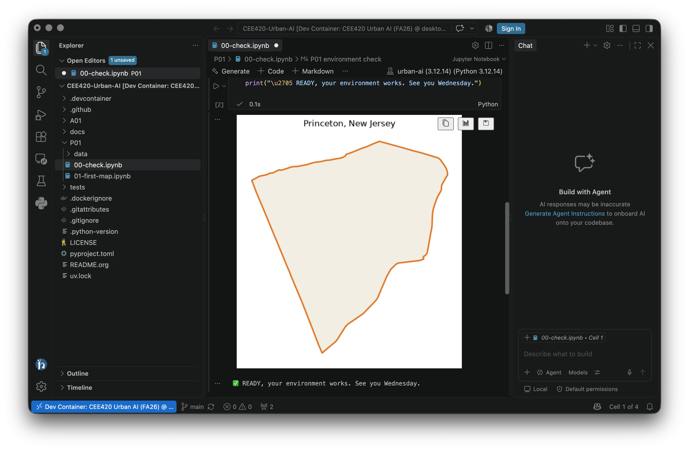

# =============================================================================
# File      : setup-codespaces.org -- Browser-based setup guide using GitHub Codespaces
# Author    : Jürgen Hackl <hackl@princeton.edu>
# Time-stamp: <2026-09-07>
# Copyright (c) 2026 Jürgen Hackl <hackl@princeton.edu>
# =============================================================================
#+OPTIONS: toc:nil
#+OPTIONS: num:nil
#+OPTIONS: tags:nil
#+TITLE: The Browser Lane, GitHub Codespaces
#+SUBTITLE: CEE420 Urban AI
#+AUTHOR: Jürgen Hackl
#+EMAIL: <hackl@princeton.edu>

# -----------------------------------------------------------------------------
#+LATEX_COMPILER: lualatex
#+LATEX_CLASS: princeton
#+LATEX_CLASS_OPTIONS: [11pt]
#+LATEX_HEADER: \version{v0.1}
# =============================================================================

#+latex: \maketitle

This is the escape hatch, and it is a good one. A Codespace runs the identical course environment on GitHub's computers and shows it to you in a browser tab. Same packages, same notebooks, same result. Nothing is installed on your laptop.

Use it if:

- Docker will not run on your machine (too little memory, an old Windows version, a Chromebook, a managed laptop you cannot install software on),
- your local setup broke and class is about to start,
- or you are working from a borrowed computer.

Cost: nothing, within the free monthly allowance. Every GitHub account gets 120 core-hours a month, and students who verify their status get more. Our sessions use two cores, so the free allowance is roughly 60 hours of active use per month. A precept costs you about 90 minutes of it.

--------------

* Setup, about 10 minutes
** 1. Get a GitHub account
You need one here, unlike the local path.

1. Go to [[https://github.com/signup]] and create an account with any email address.
2. Optional but worth it: apply for the Student Developer Pack at [[https://education.github.com/pack]] with your Princeton address. It raises the free allowance. The verification can take a few days, so do it early; you do not need it to start.

** 2. Create your Codespace
1. Go to [[https://github.com/cisgroup/CEE420-Urban-AI]].
2. Click the green *Code* button, choose the *Codespaces* tab, then *Create codespace on main*.
3. A new tab opens with VS Code in your browser. The first start takes two or three minutes while it pulls the course environment. Later starts take seconds.

# SCREENSHOT: cs-01-code-button.png, the green Code button with the Codespaces tab open

** 3. Prove it works
1. In the file list on the left, open =P01= and click =00-check.ipynb=.
2. Click *Run All*.
3. If asked which Python environment to use, pick the one marked *Recommended*, at =/opt/venv/bin/python=.
4. A map of Princeton should appear, and under it a line beginning with a green check mark: =✅ READY, your environment works.=

You will not need any other Jupyter skill today. To run a single cell later in class, click it and press =Shift+Enter=. To add your own cell, hover below an existing one and click =+ Code=.

*Your environment is set up when Princeton appears.* Reply DONE in the Canvas thread and say that you are on the Codespaces lane, so we know to look after you differently in class.

--------------

#+ATTR_LATEX: :width \linewidth :float nil

* Living in a Codespace
*Coming back.* Go to [[https://github.com/codespaces]] and click your Codespace. Everything is as you left it. Do not create a new one each time: your files live in the one you already have, and unused ones quietly consume your allowance.

*Stop it when you finish.* On [[https://github.com/codespaces]], use the "..." menu and choose *Stop codespace*. It also stops itself after 30 idle minutes. Stopped Codespaces cost you nothing; your files survive.

*Getting each week's code.* No GitHub Desktop here. In the Codespace, click the *Source Control* icon in the left bar (the little branch), then the "..." menu, then *Pull*. Same rule as everyone else: save your own copy with =-mywork= in the name before editing anything.

*Your files are not on your laptop.* They live in the Codespace. To get a notebook onto your own machine, right-click it in the file list and choose *Download*. Worth doing at the end of a session you care about.

*Do not delete a Codespace with work in it.* Deleting is permanent, and unlike stopping, it takes your files with it.

* When it does not work
- *No Codespaces tab under the Code button*: you are not signed in to GitHub. Sign in and reload.
- *"You have exhausted your usage"*: you have used the month's free hours, usually because a Codespace was left running. Stop it, and tell us; we have options.
- *The browser tab feels sluggish*: close other tabs. If it stays bad, a Codespace can also be opened from VS Code on your laptop via the GitHub Codespaces extension, which often feels smoother.
- *Your coding agent will not sign in here*: possible in the browser lane, since sign-in uses a browser callback. See [[file:agent-antigravity.org]] for what to do instead. You will not be stuck in class.
