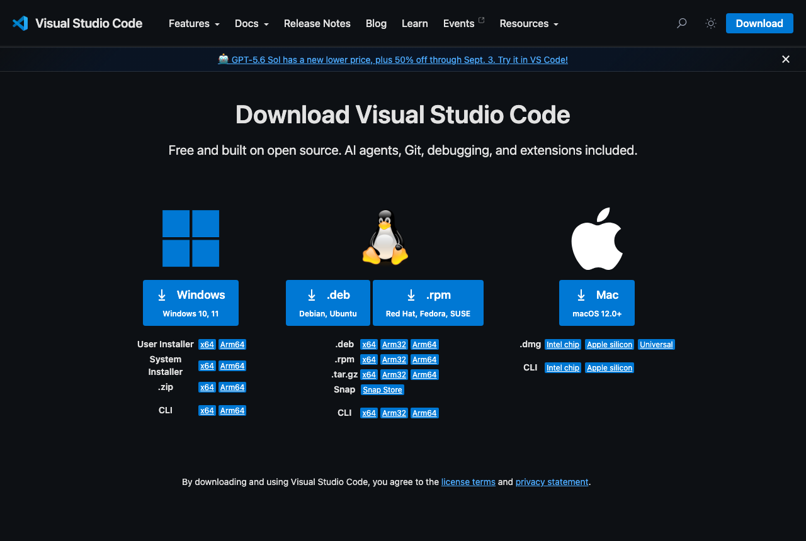
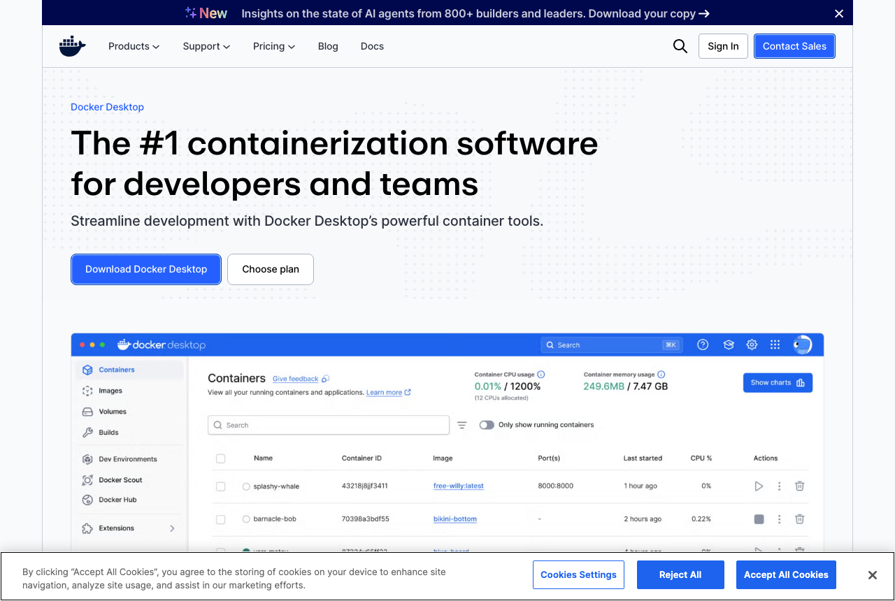
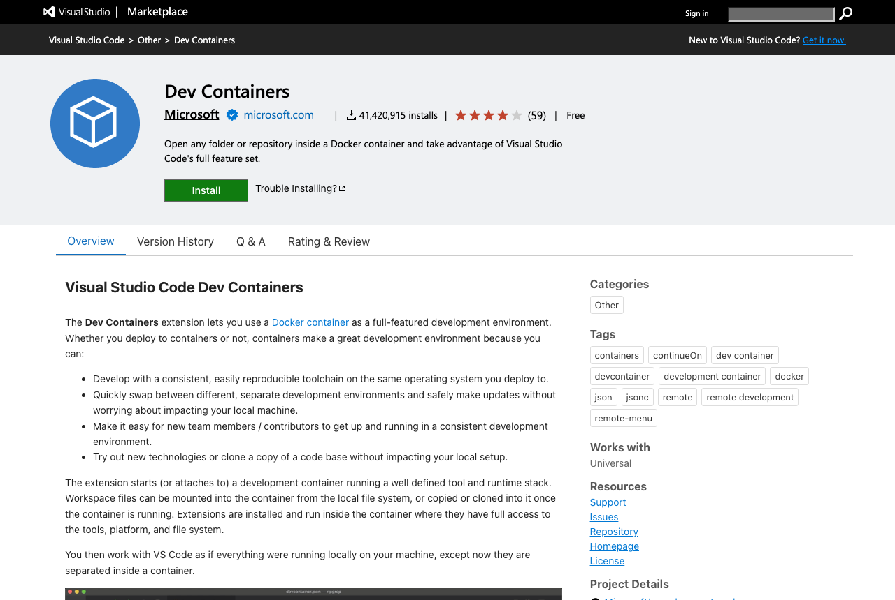

# Setup on a Mac

Time: about 30 minutes, most of it downloading. Do this at home before the first precept, on the
laptop you will bring to class. You need about 10 GB of free disk space.

You will install four things: VS Code (the editor), Docker Desktop (which runs the course
environment), GitHub Desktop (which fetches each week's code), and one VS Code extension that
connects them. Then you run one notebook to prove it all works.

If any step fails, stop and write down what you saw. An honest report in the Canvas thread is worth
more than an hour of fighting it alone, and we have a clinic for exactly this.

---

## 1. Which Mac do you have?

Click the Apple menu in the top left, then **About This Mac**. Look at the line naming the chip.

- **Apple M1, M2, M3, M4** and similar: you have Apple silicon.
- **Intel Core i5, i7, i9**: you have an Intel Mac.

You need this once, in step 3. Everything else is identical.

[SCREENSHOT: mac-01-about-this-mac.png, the About This Mac window with the chip line visible]

## 2. Install VS Code

1. Go to <https://code.visualstudio.com/download> and click the **Mac** button.
2. Open the downloaded `.zip`. It expands to **Visual Studio Code**.
3. Drag that app into your **Applications** folder. This matters: launching it from Downloads causes
   odd behavior later.
4. Open it once. If macOS asks whether you are sure you want to open an app from the internet, confirm.



## 3. Install Docker Desktop

Docker runs the course environment, a small prepared Linux system that already contains Python and
every package we use. You will never have to install a Python package by hand in this course.

1. Go to <https://www.docker.com/products/docker-desktop/>.
2. Choose the download that matches step 1: **Apple silicon** or **Intel chip**. Picking the wrong one
   is the single most common mistake here.
3. Open the downloaded `.dmg` and drag **Docker** into **Applications**.
4. Launch Docker from Applications. Accept the service agreement. When it offers **Use recommended
   settings**, accept that too, and give it your Mac password if asked.
5. You may skip the sign-in it suggests. **You do not need a Docker account for this course.**
6. Wait until the whale icon in your menu bar stops animating. Docker is ready when the Docker Desktop
   window says **Engine running**.


[SCREENSHOT: mac-04-docker-running.png, Docker Desktop showing Engine running, bottom left]

**Leave Docker running before class.** It starts on login by default. If the whale is not in your menu
bar, Docker is not running, and the next steps will fail with a confusing message.

## 4. Install GitHub Desktop and get the course code

1. Go to <https://desktop.github.com/> and download for macOS. Drag it to **Applications** and open it.
2. You can skip signing in. Our repository is public, so you need no account to get the code.
3. Choose **Clone a repository from the Internet**, then the **URL** tab, and paste:

   ```
   https://github.com/cisgroup/CEE420-Urban-AI
   ```

4. Note the **Local path** it offers, something like `~/Documents/GitHub/CEE420-Urban-AI`. That is
   where the course code now lives. Click **Clone**.

[SCREENSHOT: mac-05-github-desktop-clone.png, the Clone a repository dialog with the URL filled in]

## 5. Connect VS Code to Docker

1. Open VS Code.
2. Click the **Extensions** icon in the left bar (four squares, one detached).
3. Search for `Dev Containers`, the one published by Microsoft, and click **Install**.



## 6. Open the course in its container

This is the step that downloads the environment, roughly 1 to 2 GB, so do it on decent wifi and expect
several minutes the first time. It happens exactly once; every later start takes seconds.

1. In VS Code choose **File > Open Folder** and select the folder GitHub Desktop cloned in step 4.
2. VS Code notices the course configuration and shows a notification in the bottom right:
   **Reopen in Container**. Click it.
   If you miss the notification, press `Cmd+Shift+P`, type `Reopen in Container`, and press Return.
3. Watch the bottom left corner. It shows progress while the environment downloads, and ends up
   reading **Dev Container: CEE420 Urban AI (FA26)**. That green label is how you know you are inside
   the course environment rather than on your bare Mac.

[SCREENSHOT: mac-07-reopen-in-container.png, the Reopen in Container notification]
[SCREENSHOT: mac-08-container-connected.png, the green Dev Container label, bottom left]

## 7. Prove it works

1. In the file list on the left, open the `P01` folder and click `00-check.ipynb`.
2. Click **Run All** in the toolbar above the notebook.
3. If VS Code asks you to select a kernel, choose **Urban AI (Python 3.12)**. If it offers several
   options, that is the one; ignore anything mentioning your Mac's own Python.
4. A map of Princeton should appear, followed by a green READY line.

[SCREENSHOT: mac-09-select-kernel.png, the kernel picker with Urban AI (Python 3.12) highlighted]
[SCREENSHOT: mac-10-princeton-appears.png, the rendered Princeton boundary and the READY message]

**Your environment is set up when Princeton appears.** Reply DONE in the Canvas thread.

## 8. Getting each week's code

Every Wednesday brings a new folder. To get it:

1. Open **GitHub Desktop**.
2. Make sure **CEE420-Urban-AI** is the current repository, top left.
3. Click **Pull origin**.

That is the whole ritual. One rule keeps it painless: **before you edit any notebook, save your own
copy** with File > Save As and `-mywork` in the name, for example `01-first-map-mywork.ipynb`. Your
copies are invisible to git, so a pull can never overwrite your work or refuse to run.

If something does go wrong, [docs/troubleshooting.md](troubleshooting.md) has the two-minute fix.

## When it does not work

- **No whale icon, or "Cannot connect to the Docker daemon"**: Docker Desktop is not running. Open it
  from Applications and wait for Engine running.
- **The container download stalls**: cancel, check your wifi, and retry. It resumes rather than
  restarting from zero.
- **You are on a Mac with 8 GB of memory and everything crawls**: quit other apps, especially browsers
  with many tabs. If it stays unusable, switch to [Codespaces](setup-codespaces.md) and tell us.
- **Anything else**: bring it to the install clinic or the Canvas thread. Do not spend your evening on
  it, and do not plan to fix it during class.
