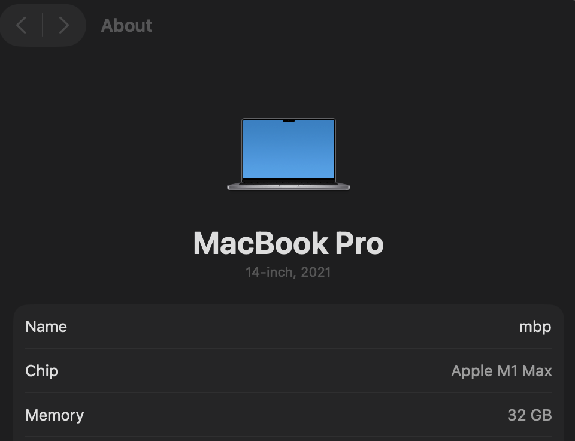
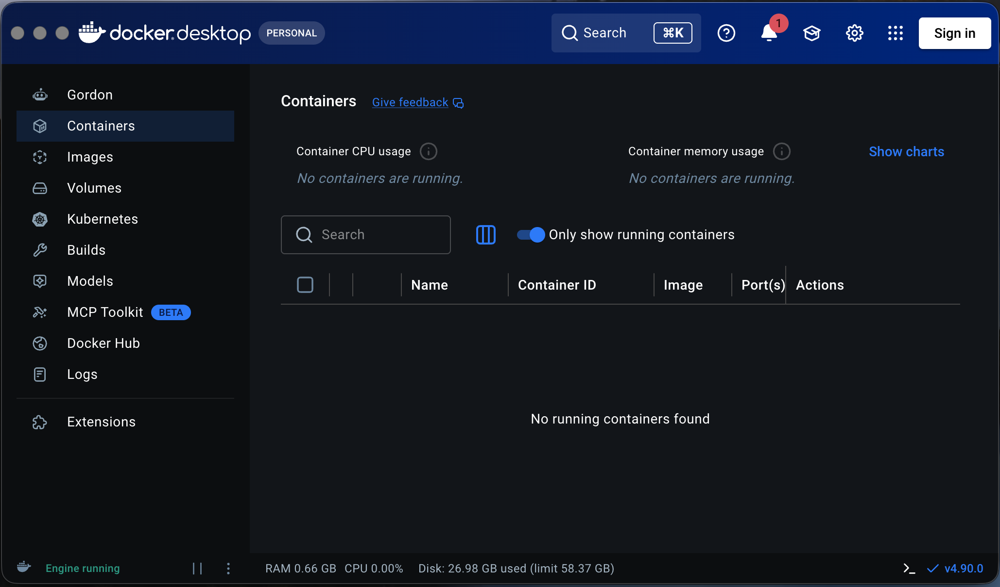
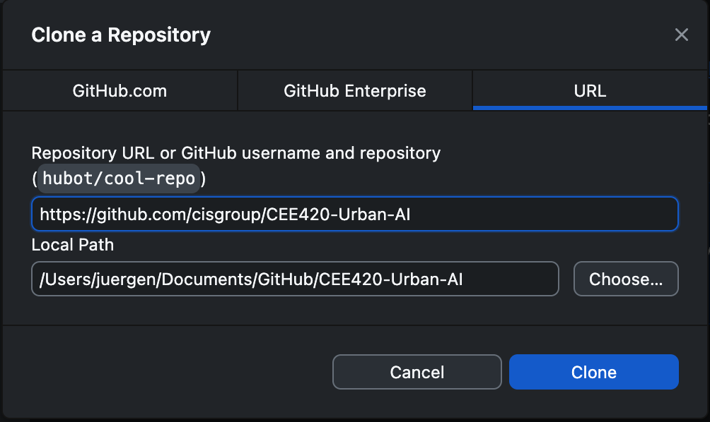
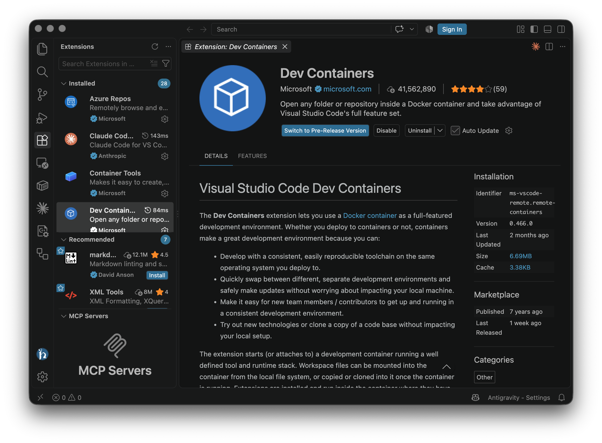
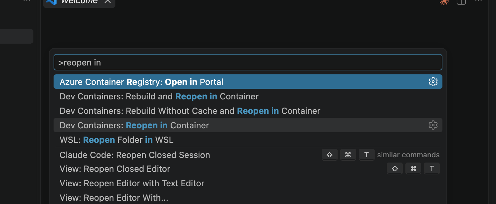
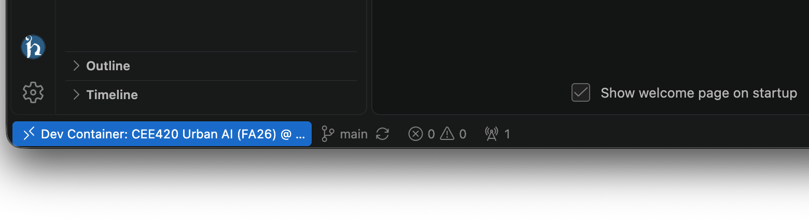
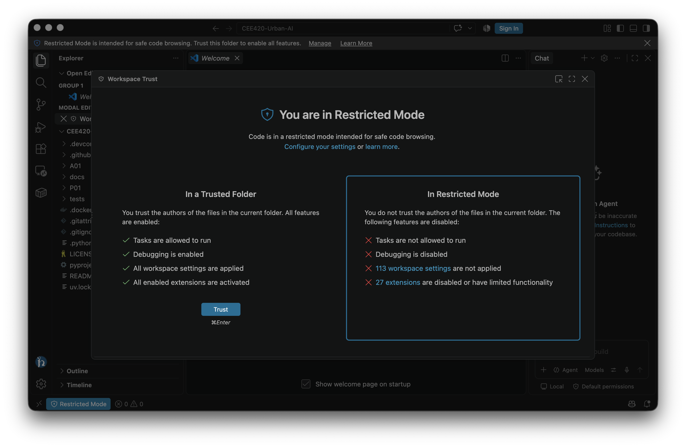
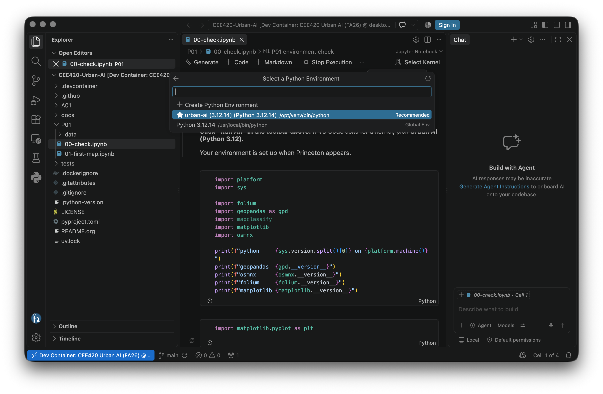

# =============================================================================
# File      : setup-mac.org -- Environment setup guide for macOS
# Author    : Jürgen Hackl <hackl@princeton.edu>
# Time-stamp: <Mon 2026-09-07 10:05 juergen>
# Copyright (c) 2026 Jürgen Hackl <hackl@princeton.edu>
# =============================================================================
#+OPTIONS: toc:nil
#+OPTIONS: num:nil
#+OPTIONS: tags:nil
#+TITLE: Setup on a Mac
#+SUBTITLE: CEE420 Urban AI
#+AUTHOR: Jürgen Hackl
#+EMAIL: <hackl@princeton.edu>

# -----------------------------------------------------------------------------
#+LATEX_COMPILER: lualatex
#+LATEX_CLASS: princeton
#+LATEX_CLASS_OPTIONS: [11pt]
#+LATEX_HEADER: \version{v0.1}
# =============================================================================

#+latex: \maketitle

Time: about 30 minutes, most of it downloading. Do this at home before the first precept, on the laptop you will bring to class. You need about 10 GB of free disk space.

You will install three applications, VS Code (the editor), Docker Desktop (which runs the course environment) and GitHub Desktop (which fetches each week's code), plus one VS Code extension that connects them. Then you run one notebook to prove it all works. Your coding agent arrives by itself with the environment, and [[file:agent-antigravity.org][docs/agent-antigravity.org]] picks up from there.

If any step fails, stop and write down what you saw. An honest report in the Canvas thread is worth more than an hour of fighting it alone, and we have a clinic for exactly this.

--------------

* 1. Which Mac do you have?
Click the Apple menu in the top left, then *About This Mac*. Look at the line naming the chip.

- *Apple M1, M2, M3, M4* and similar: you have Apple silicon.
- *Intel Core i5, i7, i9*: you have an Intel Mac.

You need this once, in step 3. Everything else is identical.

#+ATTR_LATEX: :width \linewidth :float nil

* 2. Install VS Code
1. Go to [[https://code.visualstudio.com/download]] and click the *Mac* button.
2. Open the downloaded =.zip=. It expands to *Visual Studio Code*.
3. Drag that app into your *Applications* folder. This matters: launching it from Downloads causes odd behavior later.
4. Open it once. If macOS asks whether you are sure you want to open an app from the internet, confirm.

#+ATTR_LATEX: :width \linewidth :float nil
[[file:img/shared-vscode-download.png]]

* 3. Install Docker Desktop
Docker runs the course environment, a small prepared Linux system that already contains Python and every package we use. You will never have to install a Python package by hand in this course.

1. Go to [[https://www.docker.com/products/docker-desktop/]].
2. Choose the download that matches step 1: *Apple silicon* or *Intel chip*. Picking the wrong one is the single most common mistake here.
3. Open the downloaded =.dmg= and drag *Docker* into *Applications*.
4. Launch Docker from Applications. Accept the service agreement. When it offers *Use recommended settings*, accept that too, and give it your Mac password if asked.
5. You may skip the sign-in it suggests. *You do not need a Docker account for this course.*
6. Wait until the whale icon in your menu bar stops animating. Docker is ready when the Docker Desktop window says *Engine running*.

*Leave Docker running before class.* It starts on login by default. If the whale is not in your menu bar, Docker is not running, and the next steps will fail with a confusing message.

#+ATTR_LATEX: :width \linewidth :float nil

#+ATTR_LATEX: :width \linewidth :float nil
[[file:img/mac-03-docker-download.png]]

* 4. Install GitHub Desktop and get the course code
GitHub Desktop is how you collect each week's material. You never type a git command in this course.

1. Go to [[https://desktop.github.com/]] and download for macOS. Open the =.zip=, drag *GitHub Desktop* to *Applications*, and open it.

2. The first screen offers to sign in. *Skip it.* Our repository is public, so no account is needed. Choose *Skip this step* and, if it asks for a name and email, put anything sensible; it only labels your own local edits.

3. You now land on the welcome screen, which has three large buttons. Click *Clone a Repository from the Internet*.

   If you have already closed that screen, the same dialog is always available from the menu bar: *File > Clone Repository*.

4. In the dialog, choose the *URL* tab (the third one, next to GitHub.com and GitHub Enterprise) and paste:

   #+begin_example
   https://github.com/cisgroup/CEE420-Urban-AI
   #+end_example

5. Note the *Local Path* underneath, something like =~/Documents/GitHub/CEE420-Urban-AI=. That is where the course code will live, and you will need to find it in the next step. Click *Clone*.

#+ATTR_LATEX: :width \linewidth :float nil

* 5. Connect VS Code to Docker
1. Open VS Code.
2. Click the *Extensions* icon in the left bar (four squares, one detached).
3. Search for =Dev Containers=, the one published by Microsoft, and click *Install*.

#+ATTR_LATEX: :width \linewidth :float nil

* 6. Open the course in its container
This is the step that downloads the environment, roughly 1 to 2 GB, so do it on decent wifi and expect several minutes the first time. It happens exactly once; every later start takes seconds.

1. In VS Code choose *File > Open Folder* and select the folder GitHub Desktop cloned in step 4.

2. VS Code asks whether you trust the authors of the files in this folder. Click *Yes, I trust the authors*. This is a genuine security question and you should read it whenever it appears, but here the answer is yes: it is our course repository. If you dismiss it or click the other button, VS Code stays in Restricted Mode, extensions are disabled, and nothing in the next steps will work.

3. A notification appears in the bottom right: *Reopen in Container*. Click it.

   If the notification has already gone, use the command palette instead, which is what the picture below shows: press =Cmd+Shift+P=, type =reopen in=, and choose *Dev Containers: Reopen in Container*. Read the list before you click, because several commands match and only that one is ours.

4. Watch the bottom left corner. It shows progress while the environment downloads, and ends up reading *Dev Container: CEE420 Urban AI (FA26)*. That blue label is how you know you are inside the course environment rather than on your bare Mac. It is worth glancing at every time you sit down to work.

#+ATTR_LATEX: :width \linewidth :float nil

#+ATTR_LATEX: :width \linewidth :float nil

#+ATTR_LATEX: :width \linewidth :float nil

* 7. Prove it works
1. In the file list on the left, open the =P01= folder and click =01_01_environment_check.ipynb=.
2. Click *Run All* in the toolbar above the notebook.
3. VS Code asks which Python environment to use. Take the one whose path is =/opt/venv/bin/python=. It is usually marked /Recommended/ and appears as =urban-ai (3.12.14)= in the picker, though it is also registered as /Urban AI (Python 3.12)/. The path is the part that never changes, so trust that if the names confuse you. It is named after the course, =urban-ai=, and it is the only one inside the container; anything reading =/usr/local/bin/python= is the wrong choice.

4. A map of Princeton appears, and under it a line reading =READY. Your environment works.=

You will not need any other Jupyter skill today. To run a single cell later in class, click it and press =Shift+Enter=. To add your own cell, hover below an existing one and click =+ Code=.

If you have never programmed, there is one more thing worth doing before Wednesday. Open =F00/00_01_notebooks_and_kernels.ipynb= in the same repository and work through it. It takes twenty minutes, it assumes nothing, and it explains what a notebook and a kernel actually are, which is the thing that otherwise confuses people in week three.

*Your environment is set up when Princeton appears.* Reply DONE in the Canvas thread.

#+ATTR_LATEX: :width \linewidth :float nil
[[file:img/shared-princeton-appears.png]]

#+ATTR_LATEX: :width \linewidth :float nil

* 8. Getting each week's code
Every Wednesday brings a new folder. To get it:

1. Open *GitHub Desktop*.
2. Make sure *CEE420-Urban-AI* is the current repository, top left.
3. Click *Pull origin*.

That is the whole ritual. One rule keeps it painless: *before you edit any notebook, save your own copy* with File > Save As and =-mywork= in the name, for example =01_02-mywork.ipynb=. Your copies are invisible to git, so a pull can never overwrite your work or refuse to run.

If you already know git and would rather fork the repository, please do. Add this repository as a second remote so you can still pull each week, and the =-mywork= habit stops mattering because your own commits live on your fork. Everyone else should ignore this paragraph entirely; the plain clone above is the supported path and nothing in the course needs more.

If something does go wrong, [[file:troubleshooting.org][docs/troubleshooting.org]] has the two-minute fix.

* When it does not work
- *No whale icon, or "Cannot connect to the Docker daemon"*: Docker Desktop is not running. Open it from Applications and wait for Engine running.
- *The container download stalls*: cancel, check your wifi, and retry. It resumes rather than restarting from zero.
- *You are on a Mac with 8 GB of memory and everything crawls*: quit other apps, especially browsers with many tabs. If it stays unusable, switch to [[file:setup-codespaces.org][Codespaces]] and tell us.
- *Anything else*: bring it to the install clinic or the Canvas thread. Do not spend your evening on it, and do not plan to fix it during class.
